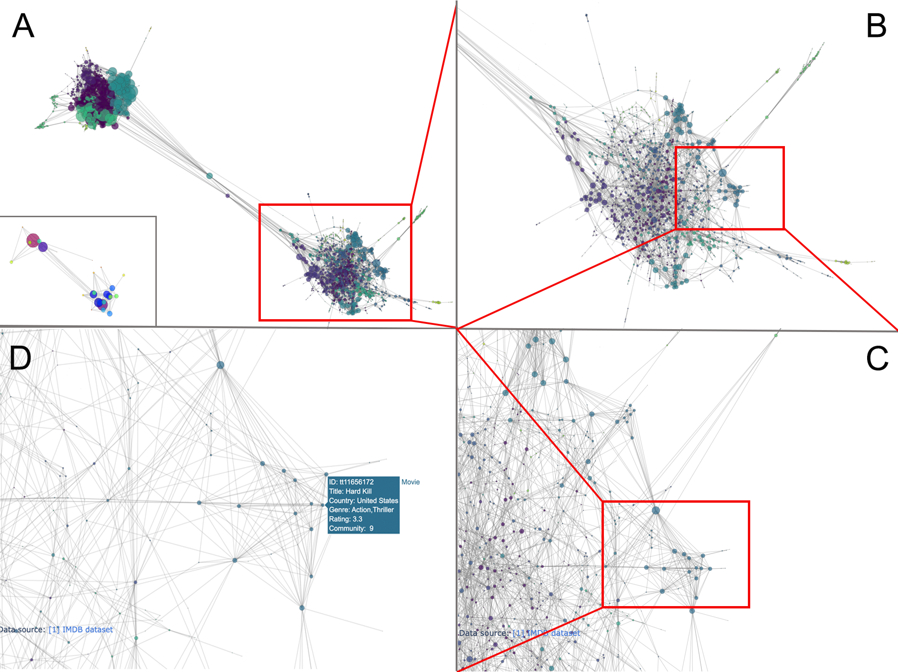
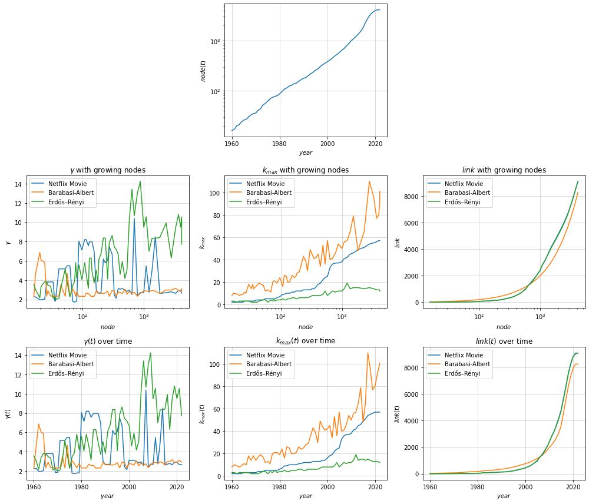
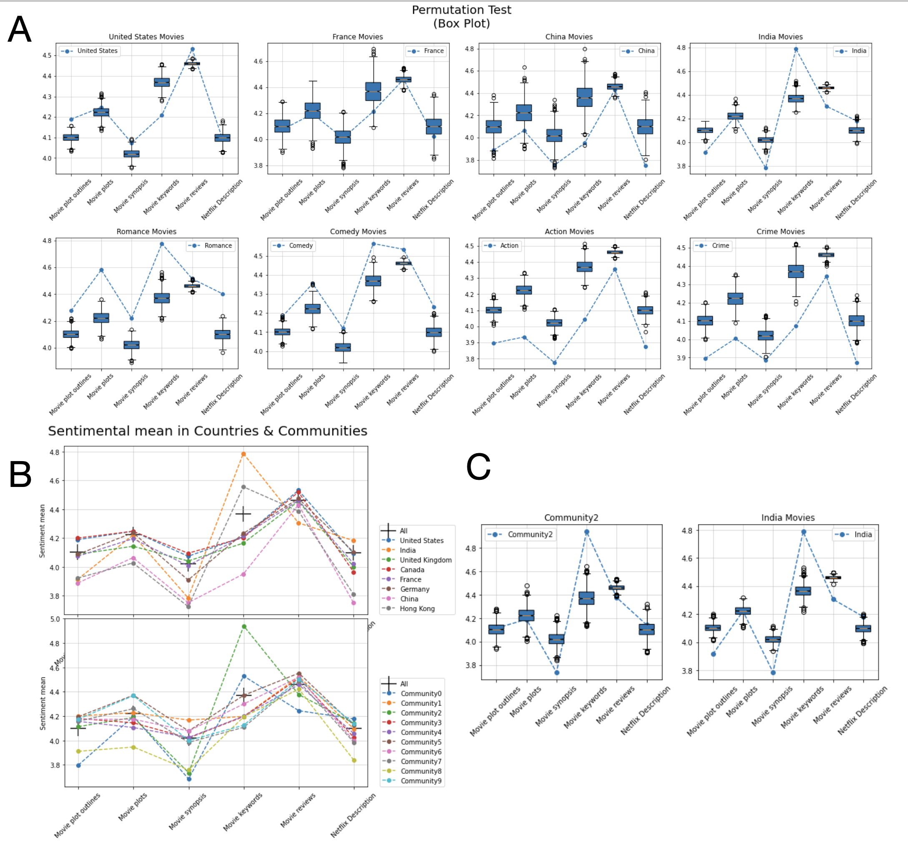

# 02805_netflix_movie_network

### Degree evolution video

## Overview of Movie Network

| Network Attribute                                                                      | Describtion                                            | Type       |
|----------------------------------------------------------------------------------------|--------------------------------------------------------|------------|
| tconst                                                                                 | IMDB ID                                                | string     |
| primaryTitle                                                                           | Movie Title                                            | string     |
| country                                                                                | Country list                                           | list       |
| genres                                                                                 | Genre list                                             | list       |
| startYear                                                                              | Release Date                                           | int year   |
| runtimeMinutes                                                                         | Movie Duration                                         | int minute |
| averageRating                                                                          | IMDB Rating                                            | float 0-10 |
| numVotes                                                                               | Rating users                                           | int        |
| budget                                                                                 | Movie Budget                                           | int       |
| boxOffice                                                                              | Box Office                                             | int       |
| 'hap_outline', 'hap_plot', 'hap_synopsis', 'hap_keyword', 'hap_review', 'hap_describe' | Sentiment values corresponding to different text types | float 1-9  |
| 'dg', 'cn', 'bt', 'ev'                                                                 | Centralities for degree, clossness, betweenness, eigenvector | float |

## Topology of Netflix Movie Network
 

## Network Evolution
 

## Sentiment Analysis

